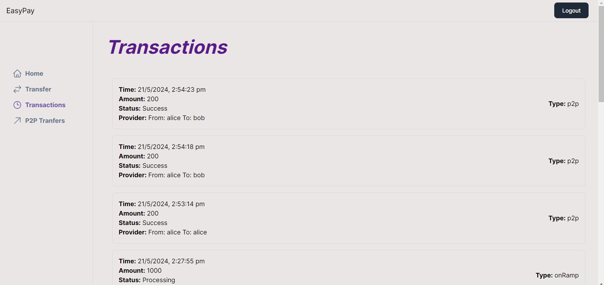
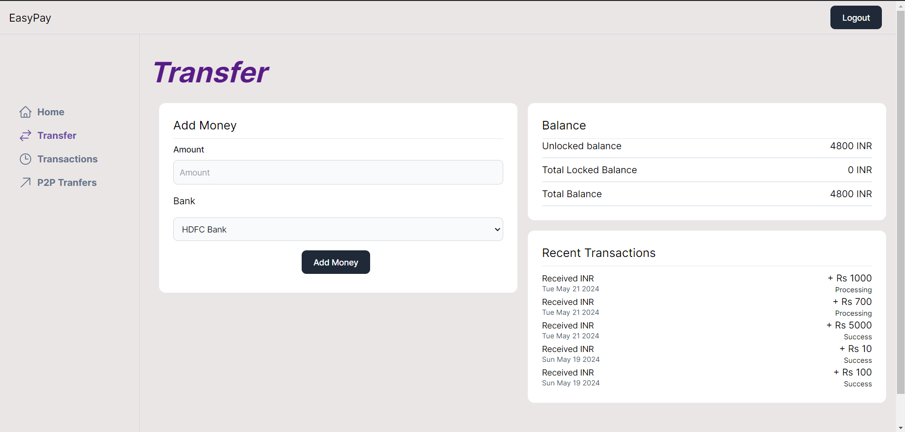
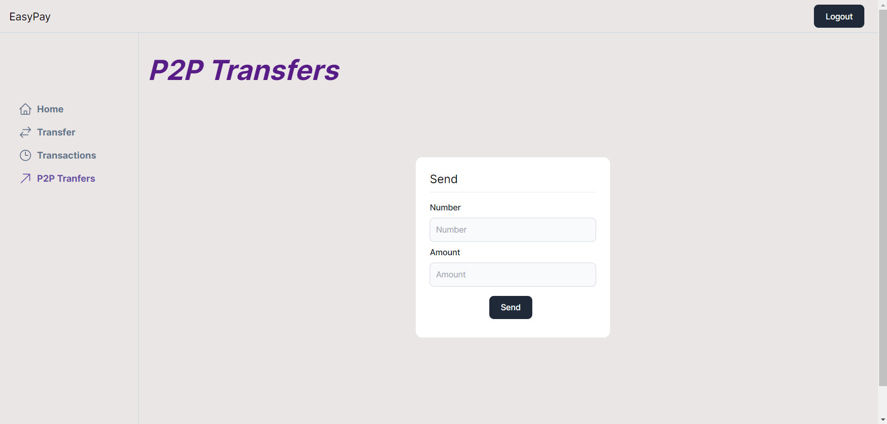

# EasyPay

EasyPay is a payment application built using Next.js and TypeScript. It enables users to add money to their wallet through webhooks and transfer money to other users who have an account on the application.

## Features

- **Dashboard**: Displays the balance of the user.
- **Add Money**: Page where users can add money to their wallet.
- **Transactions**: Page where users can view all their transactions.
- **P2P Transfer**: Page where users can send money to different users.

## Tech Stack

- **Frontend and Backend**: Next.js
- **Auxiliary Backends**: Express
- **Monorepo Management**: Turborepo
- **Database**: PostgreSQL
- **ORM**: Prisma
- **Styling**: Tailwind CSS

## Project Structure

The project follows a monorepo structure managed by Turborepo. The primary technologies used in this project are listed below:

### Frontend and Backend

- **Next.js**: The core framework used for both the frontend and backend of the application.

### Auxiliary Backends

- **Express**: Used for auxiliary backend services.

### Database

- **PostgreSQL**: The relational database used to store user data and transaction records.

### ORM

- **Prisma**: An ORM used for type-safe database access and migrations.

### Styling

- **Tailwind CSS**: A utility-first CSS framework used for styling the application.

## Pages

- **Dashboard**

The dashboard provides an overview of the user's balance.

- **Add Money**

This page allows users to add money to their wallet using webhooks.

- **Transactions**

This page displays all transactions made by the user.



- **Transfer**

This page comprises an add money component and displays the updated balance.



- **P2P Transfer**

This page allows users to transfer money to other users in the application.



## Getting Started

To get started with EasyPay, clone the repository and install the dependencies:

```bash
git clone https://github.com/prynsh/Easy_Pay-Next.js-.git
cd easypay
npm install
```
Before starting the server, please generate the Prisma client and run the migrations:
```bash
cd packages/db 
npx prisma migrate dev
npx prisma generate
```
Since we are generating the token from webhooks by ourselves, navigate to the webhooks directory, install the dependencies, and start the webhook server:
```bash
cd webhooks
npm install
npm run dev
```
Finally, return to the main directory and start the development server for the main application:
```bash
cd ..
npm run dev
```
Open http://localhost:3001 with your browser to see the result.
